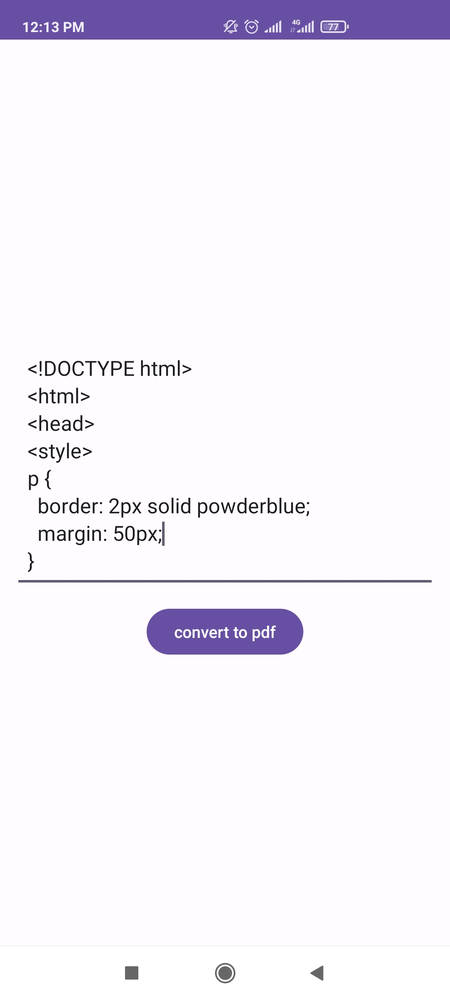
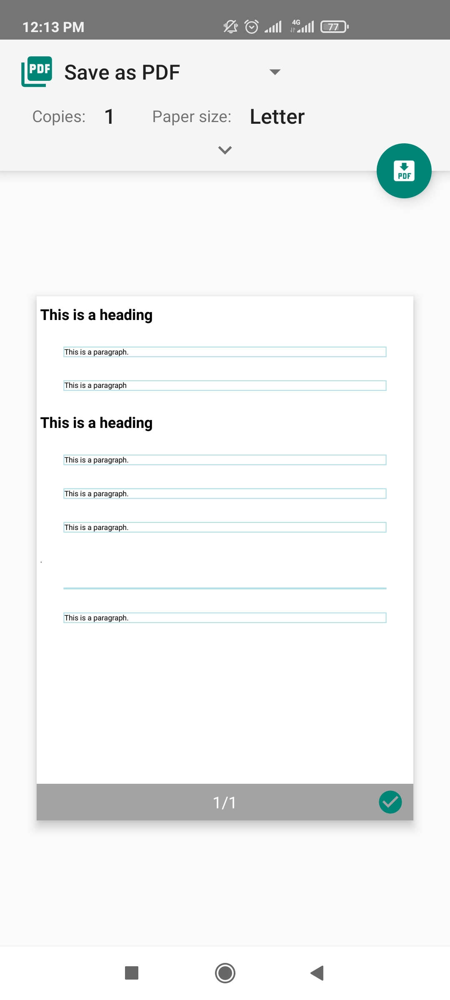

# Convert HTML code to PDF file 📑:

This repository contains a simple Android application that converts HTML code to a PDF file. The application is written in Java and uses no external libraries.

The application is intended to be a useful tool for anyone who needs to convert HTML code to a PDF file. It is easy to use and has a simple interface.

To use the application, simply enter the HTML code into the text field and click the "convert to pdf" button. The application will then generate a PDF file that contains the HTML code.

The application is still under development, but it is already functional and can be used to convert a variety of HTML code.

# Screenshots 📱:
&nbsp;&nbsp;&nbsp;&nbsp;&nbsp;&nbsp;

If you find this repository useful, please star it 🌟.

Best Regards, Majed Al-Moqbeli

Follow me: 
<a href="https://www.linkedin.com/in/majedalmoqbeli/" target="_blank">
 <i class="fa fa-linkedin-square" style="font-size:48px;color: #0a66c2;"></i>
 
</a>
